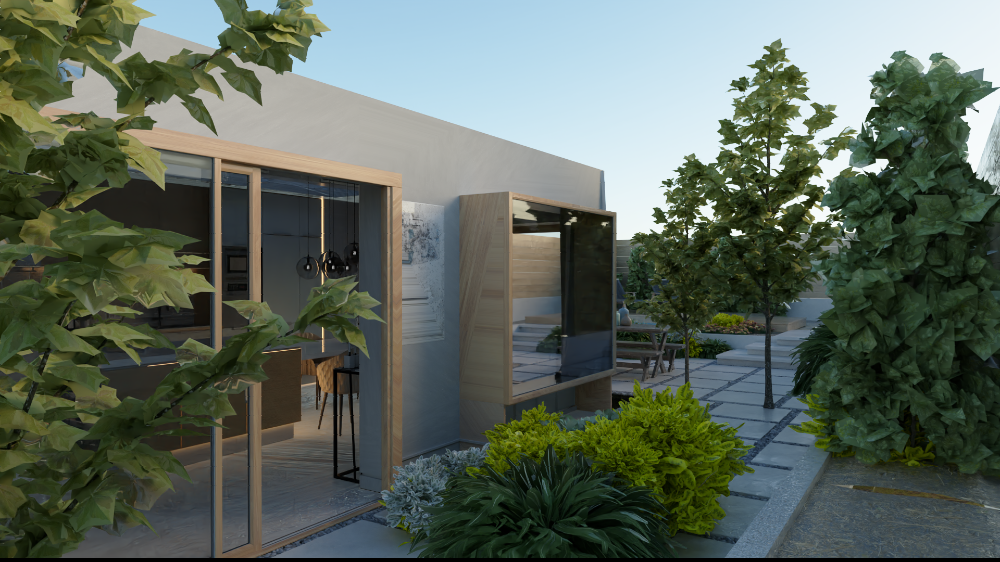
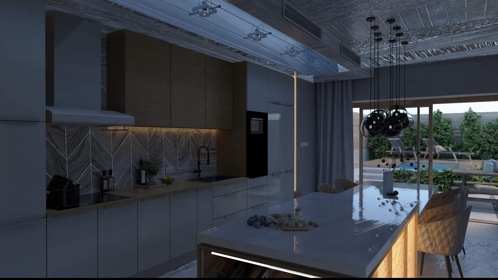

# fredholm(rtcamp9)




[レイトレ合宿9](https://sites.google.com/view/rtcamp9/home)に提出したレンダラー

* [レンダラー紹介のスライド](https://github.com/yumcyaWiz/fredholm/blob/feature/rtcamp9/docs/fredholm(rtcamp9).pdf)
* [セミナーのスライド](https://github.com/yumcyaWiz/fredholm/blob/feature/rtcamp9/docs/seminar.pdf)

## Features

* 研究用レンダラー
* Path tracing(with MIS)
* 動的に切り替え可能なレンダリング手法
* obj, glTF読み込み対応
* [Autodesk Standard Surface](https://autodesk.github.io/standard-surface/)

## Requirements

* C++ 20
* CUDA 12.1
* OptiX 7.7
* CMake (>= 3.26)
* OpenGL 4.6(for GUI app, optional)

## Build

事前に`CMakeLists.txt`内の`CMAKE_MODULE_PATH`と`OptiX_INSTALL_DIR`を環境に合わせて変えてください。

```
git submodule update --init
mkdir build
cd build
cmake -DCMAKE_BUILD_TYPE=Release ..
make
```

## Run

(注意: アセットはこのリポジトリには含まれていません)

```
cd build
./app/rtcamp9/rtcamp9
```

## References

* [Autodesk Standard Surface](https://autodesk.github.io/standard-surface/)
* [Estevez, A. C., & Kulla, C. (2017). Production Friendly Microfacet Sheen BRDF. ACM SIGGRAPH 2017.](http://www.aconty.com/pdf/s2017_pbs_imageworks_sheen.pdf)
* [Gulbrandsen, O. (2014). Artist friendly metallic fresnel. Journal of Computer Graphics Techniques, 3(4).](https://jcgt.org/published/0003/04/03/)
* [Heitz, E. (2018). Sampling the GGX distribution of visible normals. Journal of Computer Graphics Techniques (JCGT), 7(4), 1-13.](https://jcgt.org/published/0007/04/01/)
* [Hosek, L., & Wilkie, A. (2012). An analytic model for full spectral sky-dome radiance. ACM Transactions on Graphics (TOG), 31(4), 1-9.](https://cgg.mff.cuni.cz/projects/SkylightModelling/)
* [Kensler, A. (2013). Correlated multi-jittered sampling.](https://graphics.pixar.com/library/MultiJitteredSampling/#:~:text=Abstract%3A,to%20which%20they%20are%20prone.)
* https://www.shadertoy.com/view/wl2SDt
* https://www.shadertoy.com/view/llXyWr
* https://github.com/ingowald/optix7course